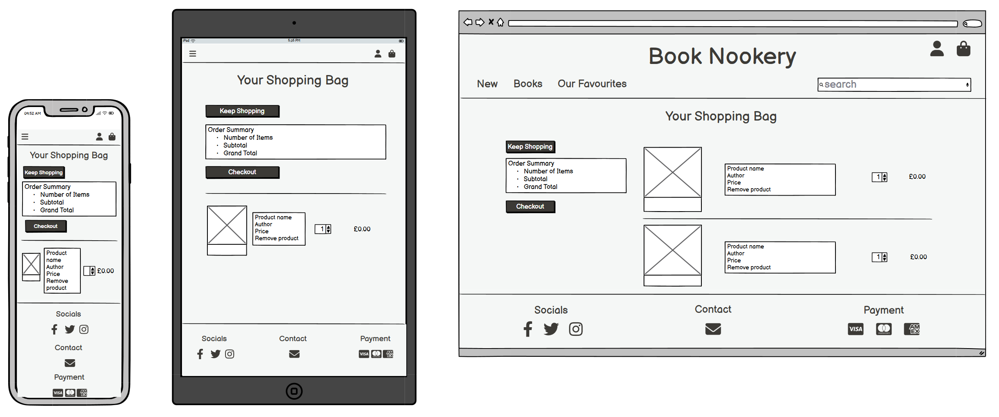

# Book Nookery

Book Nookery is an online bookshop crafted for book lovers to browse and purchase books with ease. The site allows shoppers to explore a selection of books by category, and view detailed information on each book. Users can easily contact the shop with questions and leave reviews on books they've read.

For registered users, the site provides a personalised account experience, offering quick registration, login, profile management, and access to order history. Shoppers can save books to a wishlist, search by title, author, or description, and sort results by various criteria, such as price, to find specific genres or books within their budget.

The checkout process is streamlined, allowing shoppers to review and adjust items in their cart, securely enter payment details, and receive order confirmations. For shop owners, the platform supports simple inventory management, including adding, updating, and removing books, along with real-time stock display.

[View live webpage](https://book-nookery-7651786d7c47.herokuapp.com/)

## Project Goal

The primary goal of Book Nookery from the site owner’s perspective is:

- To add, edit, and delete books with relevant details (price, description, author, image, format, stock, and category) on the website
- To enable users to make purchases of books on the website
- To display low-stocked items to users
- To provide an accessible means for users to contact the shop with any enquiries

The primary goal of Book Nookery from a site user’s perspective:

- To register for an account on the website
- To easily log in and out of the website
- To recover/change a forgotten password with ease
- To have a personalised profile that includes my order history, delivery details, and saved information
- To view a selection of books by category on the website
- To view detailed information about individual books (price, description, author, cover image, ratings, and stock availability)
- To add items to a shopping bag, adjust quantities, and complete a purchase
- To sort books by price, category, or other attributes for easier browsing
- To search for a book by title, author, or description and view the search results
- To create and manage a wishlist, allowing me to save or remove books

## Data

The data in this project includes:
- Username, email, and password for account management.
- Default contact details like phone number, addresses, town or city, county, postcode, and country.
- Messages from users, including name, email, phone number, subject, message, submission date, and status.
- Information about books, including name, SKU, ISBN, format, author, publisher, publication date, description, edition, number of pages, image, price, stock level, weight, dimensions, favourite status, and active status.
- Names and friendly names of book categories for easy browsing and grouping of books.
- User reviews for products, including user ID, product ID, review title, text, rating, and date.
- Products wishlisted by users for future reference, linking user ID to product ID.
- Details of purchases, including order number, customer info, order date, delivery cost, total amount, and payment ID.
- Specific products in an order, detailing product ID, quantity, and total cost for each item.

Users
- Create an account with an email, username, and password, and receive confirmation after signing up.
- Access their account to manage profiles, order history, and personal info.
- Easily change personal details and default address.
- Reach out to the store for questions, whether or not they have an account.

Products
- View available books, organised by categories for easy searching.
- Access detailed information about each book, including price, description, author, ratings, and cover image.
- Save books of interest for later.

Reviews
- Share reviews on books to help other shoppers.
- Read reviews from others to make informed choices.

Orders
- Review and adjust items in the shopping bag before checkout, including changing quantities and removing items.
- Complete purchases securely by entering payment information and receiving order confirmation.
- View past orders, including details like totals, delivery info, and individual products.

Categories
- Group books into categories to make it easier for users to find specific genres of books.

## Database

A relational database was implemented for Book Nookery, consisting of several tables: User, UserProfile, Contact, Category, Reviews, WishList, Product, OrderLineItem, and Order. PostgreSQL serves as the relational database, utilising one-to-many and many-to-many relationships with primary and foreign keys to efficiently manage connections between the tables. Each table is designed to handle specific aspects of the application, ensuring organised data storage and retrieval.

### Schema

<details>
<summary>Table Schema</summary>

</details>

### Models

User Model
- id (PK): The primary key, uniquely identifying each user.
- username: The user's chosen username.
- email: The user's email address.
- password: A hashed string for user authentication.

UserProfile Model
- id (PK): The primary key for the user profile, uniquely identifying each profile.
- user_id: A foreign key linking to the User model, establishing a one-to-one relationship between a user and their profile.
- default_phone_number: The user's contact number.
- default_street_address1: The first line of the user's default street address.
- default_street_address2: The second line of the user's default street address.
- default_town_or_city: The town or city of the user's address.
- default_county: The county of the user's address.
- default_postcode: The postcode code for the user's address.
- default_country: The country of the user's address.

Contact Model
- id (PK): The primary key for contact entries.
- contact_name: The name of the user contacting the site.
- contact_email: The email address of the user.
- contact_phone_number: The phone number of the user.
- contact_subject: The subject of the contact message.
- contact_message: The message sent by the user.
- date_submitted: The date and time when the contact message was sent.
- contact_actioned: A boolean indicating whether the contact message has been addressed.

Category Model
- id (PK): The primary key for categories.
- name: The name of the category (e.g., Fiction, Non-fiction).
- friendly_name: A user-friendly version of the category name for display purposes.

Product Model
- id (PK): The primary key for products.
- category_id (FK): A foreign key linking to the Category model, indicating the product's category.
- name: The name of the product (book title).
- sku: A unique identifier for the product.
- isbn: The International Standard Book Number for books.
- format_type: The format of the product (e.g., hardcover, paperback).
- author: The author of the product.
- publisher: The publisher of the product.
- publication_date: The date the product was published.
- description: A detailed description of the product.
- edition: The edition of the product.
- num_of_pages: The number of pages in the book.
- image: An image of the product.
- image_url: The URL for the product image.
- price: The price of the product.
- stock: The stock number of the product.
- weight: The weight of the product.
- dimensions: The dimensions of the product.
- is_favourite: A boolean indicating if the product is marked as a favourite by the site.
- is_active: A boolean indicating if the product is currently available for sale.

Reviews Model
- id (PK): The primary key for reviews.
- user_id (FK): A foreign key linking to the User model, indicating who wrote the review.
- product_id (FK): A foreign key linking to the Product model, indicating which product is being reviewed.
- review_title: A short title of the review.
- review_text: The main text content of the review.
- rating: A decimal value representing the user's rating (e.g., 1 to 5 stars).
- review_date: The date the review was submitted.

WishList Model
- id (PK): The primary key for the wishlist.
- user_id (FK): A foreign key linking to the User model, indicating which user owns the wishlist.
- product_id (m2m): A many-to-many relationship linking to the Product model, allowing multiple products to be added to the wishlist by the user.

OrderLineItem Model
- id (PK): The primary key for order line items.
- order_id (FK): A foreign key linking to the Order model, indicating which order this item belongs to.
- product_id (FK): A foreign key linking to the Product model, indicating which product is being ordered.
- quantity: The quantity of the product being ordered.
- line_item_total: The total cost for this line item.

Order Model
- id (PK): The primary key for orders.
- user_profile_id (FK): A foreign key linking to the UserProfile model, indicating which user profile made the order.
- order_number: A unique identifier for the order.
- full_name: The full name of the customer placing the order.
- email: The email address of the customer.
- phone_number: The phone number of the customer.
- street_address1: The first line of the shipping address.
- street_address2: The second line of the shipping address.
- town_or_city: The town or city for shipping.
- county: The county for shipping.
- postcode: The postcode code for shipping.
- country: The country for shipping.
- date: The date the order was placed.
- delivery_cost: The cost of delivery.
- order_total: The total cost of the order.
- grand_total: The total amount charged.
- original_bag: A text representation of the user's shopping bag.
- stripe_pid: The payment identifier from Stripe.

## Security

Security features have been implemented to protect user credentials and prevent unauthorised access. This includes using Django's built-in password hashing to safeguard user passwords. The @login_required decorator is employed to ensure that only logged-in users can view specific pages.

## Form Validation

For form validation, I have implemented checks to ensure that ratings are between 1 and 5, enabling users to provide valid feedback and ensuring the accuracy of product ratings. When a user attempts to submit a review for a product they have already reviewed, I have implemented backend code to check for this. If they have previously submitted a review, an error message will be displayed to inform them. Additionally, I have added a stock validation feature that prevents users from adding more items to their bag than are in stock. These measures contribute to a smooth and reliable shopping experience. The Django forms also come with built-in automatic validation, which is already implemented.

## Product Management

I have implemented a delete product feature for store owners, but instead of permanently removing products, I have added an 'is_active' field to the product model. This allows a 'soft delete' for better business logic and helps retain records of related data, such as for tax purposes. When a user attempts to delete a product, a modal will prompt them to deactivate the product instead. In the backend, all products are filtered to display only the active ones to users.

## Stock Management

I have implemented stock management to the site to monitor product inventory. For instance, when a user purchases a product, the backend automatically adjusts the stock based on the quantity purchased. If a product is out of stock, the product detail page will display "out of stock" instead of the "add to bag" button.
<details>
<summary>Out Of Stock</summary>

</details>

## CRUD

The Django admin panel allows site owners and staff to manage all model entries within the site, including updating and deleting them.

On the front end, users and site owners/staff have the following capabilities:

Site User (customer)

- Create an account
- Create a review for a product
- Read/view reviews
- Read/view products
- Update profile information
- Update bag items
- Delete bag items
- Delete wish list items

Site Owner/Staff

- Create/add new products
- Read/view products
- Update products
- Delete products

## User Experience

### Site Contents

- A navbar and footer with relevant links to explore the site.
- A home page with a welcome to the site.
- A login page for a user to log in.
- A sign up page for a user to sign up for an account.
- Password management pages generated by Django Allauth.
- A profile page for the user to view past orders and update their personal information.
- Product pages that can be filtered by genre, new releases and favourites or all products.
- Product detail page for each product.
- A wishlist page for registered users to save books for future reference.
- A bag page that shows everything a user has added to their bag.
- A checkout page for a user to make an order.
- A checkout success page to confirm a user's order.
- An add review page where registered users can add reviews to a product.
- A contact page which gives the means for a user to contact the store.
- An add product page for the site owner to add a product to the store.
- An edit product page for the site owner to edit a product currently on the store.
- Relevant error pages.

### Target Audience

Book Nookery aims to offer a diverse range of books spanning various genres, from fiction to educational materials, catering to a broad target audience:

- Avid readers and book enthusiasts
- Students
- Young adults and teenagers
- Professionals
- Hobbyists

### User Stories

#### Browsing & Viewing Books
|ID| As A    | I Want To Be Able To                                       | So That I Can                                                              |
|--|---------|------------------------------------------------------------|----------------------------------------------------------------------------|
|1 | Shopper | Browse a selection of books                                | Pick some to buy                                                           |
|2 | Shopper | View books by specific categories                          | Easily find the ones I’m interested in without sifting through everything  |
|3 | Shopper | See detailed information about each book                   | Check the price, description, author, ratings, and cover image             |
|4 | Shopper | Easily check the total cost of my items                    | Stay within my budget                                                      |
|5 | Shopper | Contact the store easily, whether I have an account or not | Get answers to any questions I have                                        |
|6 | Shopper | View and leave reviews on books                            | Share my thoughts and help others make decisions                           |

#### Registration & User Accounts
|ID| As A      | I Want To Be Able To                              | So That I Can                                                                |
|--|-----------|---------------------------------------------------|------------------------------------------------------------------------------|
|7 | Site User | Quickly create an account                         | Have a personal profile and access my information                            |
|8 | Site User | Log in and log out with ease                      | Manage my account details                                                    |
|9 | Site User | Change my password easily                         | Keep my account secure and up to date                                        |
|10| Site User | Receive confirmation after signing up             | Know my account was created successfully                                     |
|11| Site User | Have a personalised profile                       | View my order history, order confirmations, and save my personal information |

#### Sorting & Searching
|ID| As A    | I Want To Be Able To                                        | So That I Can                                                   |
|--|---------|-------------------------------------------------------------|-----------------------------------------------------------------|
|12| Shopper | Save and view my wish listed books                          | Easily find them when I’m ready to make a purchase              |
|13| Shopper | Sort books within a category                                | Find a specific genre of books I am looking for                 |
|14| Shopper | Sort books by different sorting lists                       | Find the best prices easily                                     |
|15| Shopper | Search for a book by title, author, or description          | Quickly locate the one I want to buy                            |
|16| Shopper | Clearly see my search results and the number of books found | Determine if the book I’m looking for is available              |

#### Purchasing & Checkout
|ID| As A    | I Want To Be Able To                                 | So That I Can                                                 |
|--|---------|------------------------------------------------------|---------------------------------------------------------------|
|17| Shopper | Review the items in my bag                           | See the total cost and confirm what I’m about to buy          |
|18| Shopper | Adjust the items in my bag                           | Easily make changes before completing my purchase             |
|19| Shopper | Enter my payment information quickly                 | Complete the checkout process smoothly                        |
|20| Shopper | Feel confident that my payment information is secure | Proceed with my purchase without worries                      |
|21| Shopper | See a confirmation of my order after checkout        | Ensure everything is correct                                  |

#### Admin & Store Management
|ID| As A        | I Want To Be Able To                            | So That I Can                                                                |
|--|-------------|-------------------------------------------------|------------------------------------------------------------------------------|
|22| Store Owner | Add new books to the store                      | Make them available for customers to purchase                                |
|23| Store Owner | Update book details                             | Change prices, descriptions, authors, formats, images, and stock information |
|24| Store Owner | Remove books from the store                     | Stop selling titles that are no longer available                             |
|25| Store Owner | Track and display the amount of stock available | Ensure customers know how many copies are available                          |
|26| Store Owner | Ensure errors redirect users to relevant pages  | Maintain user engagement and assist them with navigation                     |

## Accessibility

The site has been built with accessibility in mind to ensure that it is always a positive experience.

This has been achieved by:

- Semantic HTML.
- Choosing fonts and colours with high contrast.
- Adequate aria-labels for interactive features.

## Design

The site features a straightforward, simple design tailored to browsing books, viewing reviews, and encouraging reader engagement. It is user-friendly, easy to navigate, visually appealing, and responsive, with a structure that ensures simplicity in discovering and purchasing books.

### Imagery

The only images used on the site are book cover images, all sourced from the [Waterstones Site](https://www.waterstones.com/).

### Wireframes

<details>
<summary>Home Page</summary>

</details>
<details>
<summary>Register Page</summary>

</details>
<details>
<summary>Login Page</summary>

</details>
<details>
<summary>Profile Page</summary>

</details>
<details>
<summary>Products Page/s</summary>

</details>
<details>
<summary>Product Detail Page</summary>

</details>
<details>
<summary>Add Product Page</summary>

</details>
<details>
<summary>Edit Product Page</summary>

</details>
<details>
<summary>Wishlist Page</summary>

</details>
<details>
<summary>Add Review Page</summary>

</details>
<details>
<summary>Shopping Bag Page</summary>

</details>
<details>
<summary>Checkout Page</summary>

</details>
<details>
<summary>Checkout Success Page</summary>

</details>
<details>
<summary>Contact Page</summary>

</details>
<details>
<summary>Error Page/s</summary>

</details>

### Typography

The following Google Fonts were used on this site:

- Open Sans is used for the main text of the site.

<details>
<summary>Open Sans</summary>

</details>

- Amatic SC is used for the headings on the site.

<details>
<summary>Amatic SC</summary>

</details>

### Colour Scheme

The site features a clean and visually appealing design, using dark and light colors to create a clear layout with strong contrast.

## Features

### Features on Each Page

#### Navbar

Each page features a navbar containing the site heading and links to various pages. The links displayed vary based on the user's login status and account type (customer or staff). The navbar adjusts based on the device the user is using. The navbar features a search box that enables users to look for products by a specific author, and it displays the total cost of the items in their bag.

<details>
<summary>Navbar Logged Out</summary>

</details>
<details>
<summary>Navbar Logged In (Customer)</summary>

</details>
<details>
<summary>Navbar Logged In (Staff)</summary>

</details>
<details>
<summary>Navbar Mobile</summary>

</details>

User Stories covered: 4, 13, 15

#### Footer

The footer includes links to relevant pages, such as the contact page and associated social media profiles, as well as information on accepted payment methods.

<details>
<summary>Preview</summary>

</details>

#### Home Page

The homepage welcomes users with an introduction to the site and provides a link to browse all books.

<details>
<summary>Preview</summary>

</details>

User Stories Covered: 1

#### Register Page

The registration page includes a form for users to complete to create an account on the site. Upon submission, a confirmation email is sent for account verification.

<details>
<summary>Preview</summary>

</details>

User Stories Covered: 7, 10

#### Login Page

The login page provides a form where users can enter their email address or username, followed by their password, to access their account.

<details>
<summary>Preview</summary>

</details>

User Stories Covered: 8

#### Profile Page

The profile page shows the user’s personal information and provides a form for updating details, along with a link to change their password. It also displays their order history, with links to each order confirmation.

<details>
<summary>Preview</summary>

</details>

User Stories Covered: 9, 11

#### Products Page

The product pages maintain a consistent design, whether users are browsing genres, new releases, or favorites. Each page showcases available products with images and relevant details, linking to their respective product detail pages. Staff members will also have access to links for editing or deleting products. Additionally, the page includes sorting functionality, allowing users to organise products by price and other criteria.

<details>
<summary>Preview</summary>

</details>

User Stories Covered: 1, 2, 13, 14, 16, 24

#### Product Details Page

The product details page presents all essential information about the product, such as the title, author, rating, stock count, and description. It includes buttons for adding the product to the bag or wishlist, and staff members have access to links for editing or deleting the product. Furthermore, this page displays all reviews submitted by users for the product, with a link allowing the user to submit their own review.

<details>
<summary>Preview</summary>

</details>

User Stories Covered: 3, 6, 12, 24, 25

#### Add and Edit Product Pages

The add and edit product pages share the same design and are accessible only to staff members. The add product page features a form that enables staff to add a new product to the store, while the edit product page contains a form for editing an existing product in the store.

<details>
<summary>Preview</summary>

</details>

User Stories Covered: 22, 23

#### Wishlist Page

The wishlist page displays the products that users have added, with each product linking to its detail page, where users can add it to their bag. Each item on the wishlist also includes a button that allows users to remove it from their wishlist.

<details>
<summary>Preview</summary>

</details>

User Stories Covered: 12

#### Add Review Page

The add review page includes a form that allows users to submit their own review for the related product.

<details>
<summary>Preview</summary>

</details>

User Stories Covered: 6

#### Shopping Bag Page

The shopping bag page presents an order summary of the products added by the user, including the total number of items and the overall cost, along with a link to the checkout page. It also details the contents of the user's bag, allowing them to remove items or adjust quantities.

<details>
<summary>Preview</summary>

</details>

User Stories Covered: 4, 17, 18

#### Checkout Page

The checkout page includes a form for users to input their personal, delivery, and billing information to complete their order, accompanied by an order summary.

<details>
<summary>Preview</summary>

</details>

User Stories Covered: 17, 19, 20

#### Checkout Success Page

The checkout success page provides a confirmation of the user's order along with a summary of the order details.

<details>
<summary>Preview</summary>

</details>

User Stories Covered: 21

#### Contact Page

The contact page features a form for users to fill out in order to get in touch with the store.

<details>
<summary>Preview</summary>

</details>

User Stories Covered: 5

#### Delete Modal

The delete modal appears when a staff member attempts to remove a product from the store.

<details>
<summary>Preview</summary>

</details>

User Stories Covered: 24

#### Message Box

The site displays a message box when users perform actions like adding a book to their bag or wishlist. These messages can indicate success or errors, such as when a user tries to access a restricted page or attempts to add a quantity of a product that exceeds available stock.

<details>
<summary>Preview</summary>

</details>

#### Error Page/s

The error page displays the relevant error message and provides users with a link back to the site’s homepage.

<details>
<summary>Preview</summary>

</details>

User Stories Covered: 26

## Deployment

### Local Deployment

#### Fork

Forking a project creates a completely separate codebase and allows a user to make local changes to a project without affecting the original repository itself.

To fork the repository:

1. When logged into GitHub, locate and access the [repository.](https://github.com/collingsandrew/milestone-four-project)
2. At the top right of the repository, there will be a 'fork' option.

#### Clone

Cloning a project allows a user to make contributions to the main repository, with permission.

To clone the repository:

1. When logged into GitHub, locate and access the [repository.](https://github.com/collingsandrew/milestone-four-project)
2. Above the files to the right, select the 'code' drop down button and select either HTTPS, SSH or GitHub CLI and then copy the URL below.
3. Then, in your chosen code editor, in the terminal, type <code>git clone</code> and paste the URL that you copied previously, and then press enter.
4. Create an env.py file in the root directory of the project and enter your key, value pairs, ensuring you enter your relevant values.
5. Install the required packages as per the requirements.txt file.

### Heroku Deployment

1. Create and account at [Heroku.com](https://www.heroku.com/home)
2. Create a new app and give it your own name and choose a region.
3. Open the settings tab.
4. Add the config var DATABSE_URL with the value being your postgreSQL database url.
5. In your IDE open the terminal and install dj_database_url and psycopg2 to connnect to the external database. <code>pip3 install dj_database_url==0.5.0 psycopg2</code>
6. Update requirements.txt with the new packages you have just installed. <code>pip3 freeze > requirements.txt</code>
7. In settings.py, underneath <code>import os</code> type <code>import dj_database_url</code>
8. Within the databases section comment out the current DATABASES code and enter the following:

Ensure you DO NOT commit this code as it contains the database url.

```bash

# DATABASES = {
#     'default': {
#         'ENGINE': 'django.db.backends.sqlite3',
#         'NAME': os.path.join(BASE_DIR, 'db.sqlite3'),
#     }
# }

DATABASES = {
    'default': dj_database_url.parse('your-database-url-here')
}

```
9. In the terminal, run <code>python3 manage.py showmigrations</code> to confirm the connection with the database. You will know you are connected if a list of all migrations are shown without checks within their brackets.
10. Run <code>python3 manage.py migrate</code> to migrate the database models to the database.
11. Run <code>python3 manage.py loaddata categories</code> to load in the fixtures (categories MUST be loaded first over products).
12. After loading the categories fixtures, run <code>python3 manage.py loaddata products</code> to then load in the products fixtures.
13. Create a superuser for the new database by running <code>python3 manage.py createsuperuser</code> in the terminal, following the steps to create a superuser.
14. After that is done, delete the new DATABASE code and update the old code with an if/else statement like the following:

```bash

if 'DATABASE_URL' in os.environ:
    DATABASES = {
        'default': dj_database_url.parse(os.environ.get('DATABASE_URL'))
    }
else:
    DATABASES = {
        'default': {
            'ENGINE': 'django.db.backends.sqlite3',
            'NAME': os.path.join(BASE_DIR / 'db.sqlite3'),
        }
    }

```
15. Run <code>pip3 install gunicorn</code> this will act as our web server.
16. Run <code>pip3 freeze > requirements.txt</code> to freeze gunicorn into the requirement.txt file.
17. Create a Procfile in the root directory of the project and enter the following code with your relevant app name:

```bash

web: gunicorn your_app_name_here.wsgi:application

```
18. Login to Heroku in your terminal by running <code>heroku login -1</code>. If you have MFA you will need to get your API key from Heroku and use that as the password to login.
19. Run <code>heroku config:set DISABLE_COLLECTSTATIC=1 --app heroku-app-name-here</code> to disbale Heroku collecting static files.
20. In settings.py, paste your Heroku site url to your allowed hosts:
```bash

ALLOWED_HOSTS = ['your-heroku-app-url-here', 'localhost']

```
21. You can connect your Heroku app to your GitHub account with the relevant repository in the deploy section on Heroku and then commit and push your changes. Or you can run the commands <code>git push heroku master</code> followed by <code>heroku git:remote -a "your app name here"</code>
22. The site should now be deployed to Heroku without any static files.
23. If not already, connect your app to your GitHub by going to the deploy tab in your Heroku app, click 'Connect to GitHub' and then connect to the relevant repository. Enable automatic deploys for the app to redeploy after each push to GitHub.

### AWS Setup For Objects (Static and Media Files)

#### Create Bucket

1. Create an AWS account at [AWS](https://aws.amazon.com/)
2. Open the S3 appication and create a bucket:
    - Choose a name for the bucket
    - Click ACLs enabled
    - Bucket owner preferred should be selected
    - Uncheck block all public access and accept the warning
    - Click create bucket
3. Click on the properties tab and enable static web hosting with default values in the fields.
4. Click on the permissions tab and add the following CORS configuration:
```bash

[
{
"AllowedHeaders": [
"Authorization"
],
"AllowedMethods": [
"GET"
],
"AllowedOrigins": [
"*"
],
"ExposeHeaders": []
}
]


```
5. Click on the bucket policy tab and click policy generator following these steps:
    - Select type of policy as S3 Bucket Policy
    - In the principal field add a *
    - Select 'GetObject' in the actions drop down
    - Copy your buckets ARN from the bucket policy page with a / at the end of it
    - Click add statement and then generate policy, copying the code that is generated
    - Copy the code into the bucket policy editor and click save
6. Go to the access control list tab and click edit and enable List for Everyone (public access) and
accept the warning box.

#### Create IAM User

1. Open the IAM application.
2. Create a new user group.
3. Go to 'policies' and click 'create new policy'.
4. Click on the JSON tab and click import policy.
5. Click "import managed policy" and select the AmazonS3FullAccess policy.
6. Update the code with your ARN, it should look similar to the following:
```bash

{
    "Version": "2012-10-17",
    "Statement": [
        {
            "Effect": "Allow",
            "Action": [
                "s3:*",
                "s3-object-lambda:*"
            ],
            "Resource": [
                "your-arn-here",
                "your-arn-here/*"
            ]
        }
    ]
}

```
7. Click review policy, giving it a name and description and then clicking create policy.
8. Add the new policy to the user group by going to your new user group, permissions and add permissions tab clicking 'attach policies', search for the policy, select it and click attach policy.
9. Go to Users and create a new user, adding the user to the user group that was just created.
10. Retrieve access kesy by following these steps:
    - Go to IAM and select 'Users'
    - Select the user for whom you wish to create a CSV file.
    - Select the 'Security Credentials' tab
    - Scroll to 'Access Keys' and click 'Create access key'
    - Select 'Application running outside AWS', and click next
    - On the next screen, you can leave the 'Description tag value' blank. Click 'Create Access Key'
    - Click the 'Download .csv file' button

#### Connect Django App to AWS S3

1. Run the following:
    - <code>pip3 install boto3</code>
    - <code>pip3 install django-storages</code>
    - <code>pip3 freeze > requirements.txt</code>
2. In settings.py add 'storages' to installed apps.
3. In settings.py add the following code:
```bash

if 'USE_AWS' in os.environ:
    AWS_S3_OBJECT_PARAMETERS = {
        'Expires': 'Thu, 31 Dec 2099 20:00:00 GMT',
        'CacheControl': 'max-age=94608000',
    }

    AWS_STORAGE_BUCKET_NAME = 'your s3 bucket name here'
    AWS_S3_REGION_NAME = 'your s3 bucket region here'
    AWS_ACCESS_KEY_ID = os.environ.get('AWS_ACCESS_KEY_ID')
    AWS_SECRET_ACCESS_KEY = os.environ.get('AWS_SECRET_ACCESS_KEY')
    AWS_S3_CUSTOM_DOMAIN = f'{AWS_STORAGE_BUCKET_NAME}.s3.amazonaws.com'
    AWS_S3_FILE_OVERWRITE = False

    AWS_MEDIA_LOCATION = 'media'
    AWS_STATIC_LOCATION = 'static'

    STORAGES = {
        'default': {
            'BACKEND': 'storages.backends.s3boto3.S3Boto3Storage',
            'OPTIONS': {
                'location': AWS_MEDIA_LOCATION,
            },
        },

        'staticfiles': {
            'BACKEND': 'storages.backends.s3boto3.S3StaticStorage',
            'OPTIONS': {
                'location': AWS_STATIC_LOCATION,
            },
        },
    }

    MEDIA_URL = f'https://{AWS_S3_CUSTOM_DOMAIN}/{AWS_MEDIA_LOCATION}/'
    STATIC_URL = f'https://{AWS_S3_CUSTOM_DOMAIN}/{AWS_STATIC_LOCATION}/'

```
4. On Heroku, update your apps config vars with the following keys and values:
    - <code>AWS_ACCESS_KEY_ID</code> | <code>THE ACCESS KEY FROM AWS THAT WAS DOWNLOADED</code>
    - <code>AWS_SECRET_ACCESS_KEY</code> | <code>THE SECRET ACCESS KEY FROM AWS THAT WAS DOWNLOADED</code>
    - <code>USE_AWS</code> | <code>TRUE</code>
5. Then remove the DISABLE_COLLECTSTATIC from the config vars.
6. Commit and push these changes to GitHub. Your app should deploy on heroku running collectstatic.
7. Your S3 bucket should now contain any static files in the app.
8. Create a folder within your S3 bucket called 'media' and upload any required media files.

### Stripe

1. On the developers section of the Stripe site, go to the API keys section.
2. Copy your secret keys to your Heroku apps config vars:
    - <code>STRIPE_PUBLIC_KEY</code> | <code>YOUR_KEY_GOES_HERE</code>
    - <code>STRIPE_SECRET_KEY</code> | <code>YOUR_KEY_GOES_HERE</code>
3. Create a webhook with the URL of the deployed site, again adding the secret key your Heroku apps config vars:
    - <code>STRIPE_WH_SECRET</code> | <code>YOUR_KEY_GOES_HERE</code>
4. Be sure to test the webhook.

### Summary

The code used for S3 bucket setup in settings.py is for Django versions 4.2 and higher.

Your config vars on Heroku should look like the following:
<details>
<summary>Config Vars</summary>

</details>

## Testing

The testing details and results for this project are documented in the [TESTING.md](TESTING.md) file.

## Technologies

### Languages

- HTML
- CSS
- JavaScript
- Python

### Databases

- sqlite3 (for development with Django)
- PostgreSQL
- AWS S3 (for object storage)

### Frameworks

- Django version 5.1
- Bootstrap 5

### Libraries and Packages

- Django Allauth - for user account funcionality
- django-countries - provides a list of countries
- django-crispy-forms - rendering of forms
- crispy-bootstrap5 - to integrate crispy forms to bootstrap5
- django-storages - for cloud storage
- gunicorn - Python WSGI HTTP server
- pillow - support for image files
- psycopg2 - for interaction with postgresql databases
- boto3 - for connection with AWS S3 bucket
- Font Awesome - for icons

### Software/Apps Used

- [Chrome Developer Tools](https://developer.chrome.com/docs/devtools)
- [JSHint](https://jshint.com/)
- [Code Institute Python Linter](https://pep8ci.herokuapp.com/)
- [W3C HTML Validator](https://validator.w3.org/)
- [W3C CSS Validator](https://jigsaw.w3.org/css-validator/)
- [Wave Accessibility Evaluation Tool](https://wave.webaim.org/)
- [Balsamiq](https://balsamiq.com/wireframes/)
- [Lucid Chart](https://www.lucidchart.com/pages/?)
- [Google Fonts](https://fonts.google.com/about)
- [Git](https://git-scm.com/)
- [Github](https://github.com/)
- [GitPod](https://www.gitpod.io/)
- [Favicon](https://favicon.io/)
- [YouTube](https://www.youtube.com/)
- [TempMail](https://temp-mail.org/en/)

### Stripe

[Stripe](https://stripe.com/gb?utm_campaign=EMEA_UK_en_Google_Search_Brand_Stripe_EXA-2032860449&utm_medium=cpc&utm_source=google&ad_content=604272871169&utm_term=stripe&utm_matchtype=e&utm_adposition=&utm_device=c&gad_source=1&gclid=CjwKCAjw-JG5BhBZEiwAt7JR61jVbAC20OfkTGsPg4mMcyNBjaL6BgKpBkgv2M4kcZhoj9h1oFmpohoCeHYQAvD_BwE) was used to implement the payment system for the site.

The following card details can be used to test the funciotnality of the sites's payment system.

| Type| Card No| Expiry| CVC| ZIP|
| --- | --- | --- | --- | --- |
| Success| Visa | 4242 4242 4242 4242 | A date in the future | Any 3 digits | Any 5 digits |
| Require authorisation | 4000 0027 6000 3184 | A date in the future | Any 3 digits | Any 5 digits |
| Declined | 4000 0000 0000 0002 | A date in the future | Any 3 digits | Any 5 digits |

## Credits

- Code Institute for their course material on their project 'Boutique Ado'.
- [Stack Overflow](https://stackoverflow.com/) for ideas and solving issues.
- [Learn Django](https://learndjango.com/tutorials/django-login-and-logout-tutorial#password-change) for adding password change functionality.
- [Adiyat Mubarak](https://adiyatmubarak.wordpress.com/2017/01/13/add-http_referer-in-django-test-client/) to test redirection to same page.
- [Stack Overflow post](https://stackoverflow.com/questions/849142/how-to-limit-the-maximum-value-of-a-numeric-field-in-a-django-model) for adding a mininum and maximimum integer value to a model field.
- [Treehouse](https://teamtreehouse.com/community/how-to-perform-an-average-with-annotation) to calculate the average rating for each product.
- [Cloud With Django - YouTube](https://www.youtube.com/watch?v=JQVQcNN0cXE&list=PLF5aobzHSchkhjYGigJ6ldBQJ39VSi69o&index=25) for implementing Amazon S3 storage on newer versions of Django.

## Content

All of the product content on the site was sourced from the [Waterstones](https://www.waterstones.com/) website.

## Acknowledgements

- My mentor for guidance throughout the project.
- Code Institute for their course material.
- My cohort for help and support throughout the project.
- The Slack community for helpful advice and support.
- Tutor support from Code Institute.