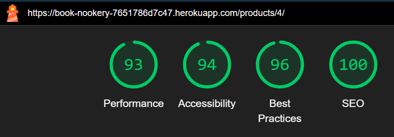

# Book Nookery Testing

[View live webpage](https://book-nookery-7651786d7c47.herokuapp.com/)

Throughout the development of Book Nookery, I performed continuous testing using Chrome Developer Tools and manual testing to ensure optimal functionality. I also wrote unit tests to make sure the code worked well and was free of errors.

Google Developer Tools was used to test the site on various device sizes.

## Automated Testing

### Unit Tests

I wrote a total of 39 unit tests using Django's TestCase framework to test the views, models, and forms across each app in the project. Using the coverage tool, I identified areas needing additional tests and reached a coverage rate of 78%. Unit testing is an area I am eager to learn more about, recognising its importance in becoming a great developer.

<details>
<summary>Testing Results</summary>

</details>

<details>
<summary>Coverage</summary>

```bash
Name                                                              Stmts   Miss  Cover
-------------------------------------------------------------------------------------
bag/__init__.py                                                       0      0   100%
bag/admin.py                                                          1      0   100%
bag/apps.py                                                           4      0   100%
bag/contexts.py                                                      22      6    73%
bag/migrations/__init__.py                                            0      0   100%
bag/models.py                                                         1      0   100%
bag/templatetags/__init__.py                                          0      0   100%
bag/templatetags/bag_tools.py                                         5      1    80%
bag/test_views.py                                                    22      0   100%
bag/urls.py                                                           3      0   100%
bag/views.py                                                         44     18    59%
book_nookery/__init__.py                                              0      0   100%
book_nookery/asgi.py                                                  4      4     0%
book_nookery/settings.py                                             68     21    69%
book_nookery/urls.py                                                  5      0   100%
book_nookery/wsgi.py                                                  4      4     0%
checkout/__init__.py                                                  1      0   100%
checkout/admin.py                                                    12      0   100%
checkout/apps.py                                                      6      0   100%
checkout/forms.py                                                    18      0   100%
checkout/migrations/0001_initial.py                                   6      0   100%
checkout/migrations/0002_alter_orderlineitem_order.py                 5      0   100%
checkout/migrations/0003_order_original_bag_order_stripe_pid.py       4      0   100%
checkout/migrations/0004_alter_order_country.py                       5      0   100%
checkout/migrations/0005_order_user_profile.py                        5      0   100%
checkout/migrations/__init__.py                                       0      0   100%
checkout/models.py                                                   50     12    76%
checkout/signals.py                                                   9      2    78%
checkout/test_forms.py                                                9      0   100%
checkout/urls.py                                                      4      0   100%
checkout/views.py                                                    94     78    17%
checkout/webhook_handler.py                                          73     57    22%
checkout/webhooks.py                                                 28     19    32%
contact/__init__.py                                                   0      0   100%
contact/admin.py                                                      8      0   100%
contact/apps.py                                                       4      0   100%
contact/forms.py                                                     15      0   100%
contact/migrations/0001_initial.py                                    5      0   100%
contact/migrations/0002_alter_contact_options.py                      4      0   100%
contact/migrations/__init__.py                                        0      0   100%
contact/models.py                                                    14      0   100%
contact/test_forms.py                                                 9      0   100%
contact/test_models.py                                                8      0   100%
contact/test_views.py                                                 7      0   100%
contact/urls.py                                                       3      0   100%
contact/views.py                                                     23     12    48%
home/__init__.py                                                      0      0   100%
home/admin.py                                                         1      0   100%
home/apps.py                                                          4      0   100%
home/migrations/__init__.py                                           0      0   100%
home/models.py                                                        1      0   100%
home/test_views.py                                                    6      0   100%
home/urls.py                                                          3      0   100%
home/views.py                                                         3      0   100%
manage.py                                                            11      2    82%
products/__init__.py                                                  0      0   100%
products/admin.py                                                    12      0   100%
products/apps.py                                                      4      0   100%
products/forms.py                                                    28      0   100%
products/migrations/0001_initial.py                                   6      0   100%
products/migrations/0002_product_is_active.py                         4      0   100%
products/migrations/0003_remove_product_average_rating.py             4      0   100%
products/migrations/0004_remove_product_language.py                   4      0   100%
products/migrations/0005_alter_category_options.py                    4      0   100%
products/migrations/0006_review.py                                    7      0   100%
products/migrations/__init__.py                                       0      0   100%
products/models.py                                                   43      1    98%
products/test_forms.py                                               19      0   100%
products/test_models.py                                              10      0   100%
products/test_views.py                                              113      0   100%
products/urls.py                                                      3      0   100%
products/views.py                                                   128     32    75%
profiles/__init__.py                                                  0      0   100%
profiles/admin.py                                                     1      0   100%
profiles/apps.py                                                      4      0   100%
profiles/forms.py                                                    18      1    94%
profiles/migrations/0001_initial.py                                   8      0   100%
profiles/migrations/__init__.py                                       0      0   100%
profiles/models.py                                                   21      0   100%
profiles/test_forms.py                                               17      2    88%
profiles/test_models.py                                               8      0   100%
profiles/test_views.py                                               27      0   100%
profiles/urls.py                                                      3      0   100%
profiles/views.py                                                    26      1    96%
wishlist/__init__.py                                                  0      0   100%
wishlist/admin.py                                                     1      0   100%
wishlist/apps.py                                                      4      0   100%
wishlist/migrations/0001_initial.py                                   6      0   100%
wishlist/migrations/__init__.py                                       0      0   100%
wishlist/models.py                                                    8      0   100%
wishlist/test_models.py                                              12      0   100%
wishlist/test_views.py                                               28      0   100%
wishlist/urls.py                                                      3      0   100%
wishlist/views.py                                                    32      3    91%
-------------------------------------------------------------------------------------
TOTAL                                                              1257    276    78%
```

</details>

### HTML Validation

[W3C](https://validator.w3.org/) Markup Validation Service was used to validate the HTML of the site.
Some pages on the site encountered errors, but these issues were due to the backend forms or libraries, rather than my custom HTML.

<details>
<summary>Home</summary>

</details>
<details>
<summary>Login</summary>

</details>
<details>
<summary>Register</summary>

</details>
<details>
<summary>Profile</summary>

</details>
<details>
<summary>Products</summary>

</details>
<details>
<summary>Product Detail</summary>

</details>
<details>
<summary>Add Product</summary>

</details>
<details>
<summary>Edit Product</summary>

</details>
<details>
<summary>Wishlist</summary>

</details>
<details>
<summary>Add Review</summary>

</details>
<details>
<summary>Shopping Bag</summary>

</details>
<details>
<summary>Checkout</summary>

</details>
<details>
<summary>Order Confirmation</summary>

</details>
<details>
<summary>Contact</summary>

</details>

### CSS Validation

[W3C](https://jigsaw.w3.org/css-validator/) Jigsaw CSS Validation Service was used to validate the CSS of the site.
The CSS file base.css passed with no errors.

<details>
<summary>base.css</summary>

</details>

### JavaScript Validation

[JS Hint](https://jshint.com/) JS Validation Service was used to validate the Javascript files. All pass with no issues.

<details>
<summary>base.js</summary>

</details>
<details>
<summary>products.js</summary>

</details>
<details>
<summary>stripe_elements.js</summary>

</details>
<details>
<summary>country_field.js</summary>

</details>

### Python Validation

[pep8ci Python Linter](https://pep8ci.herokuapp.com/) was used to check the python code of the site, all files returned no errors.

#### Home

<details>
<summary>views.py</summary>

</details>
<details>
<summary>urls.py</summary>

</details>
<details>
<summary>test_views.py</summary>

</details>

#### Bag

<details>
<summary>views.py</summary>

</details>
<details>
<summary>urls.py</summary>

</details>
<details>
<summary>contexts.py</summary>

</details>
<details>
<summary>test_views.py</summary>

</details>

#### Checkout

<details>
<summary>admin.py</summary>

</details>
<details>
<summary>forms.py</summary>

</details>
<details>
<summary>models.py</summary>

</details>
<details>
<summary>signals.py</summary>

</details>
<details>
<summary>test_forms.py</summary>

</details>
<details>
<summary>urls.py</summary>

</details>
<details>
<summary>views.py</summary>

</details>
<details>
<summary>webhook_handler.py</summary>

</details>
<details>
<summary>webhooks.py</summary>

</details>

#### Contact

<details>
<summary>admin.py</summary>

</details>
<details>
<summary>forms.py</summary>

</details>
<details>
<summary>models.py</summary>

</details>
<details>
<summary>test_forms.py</summary>

</details>
<details>
<summary>test_models.py</summary>

</details>
<details>
<summary>test_views.py</summary>

</details>
<details>
<summary>urls.py</summary>

</details>
<details>
<summary>views.py</summary>

</details>

#### Products

<details>
<summary>admin.py</summary>

</details>
<details>
<summary>forms.py</summary>

</details>
<details>
<summary>models.py</summary>

</details>
<details>
<summary>test_forms.py</summary>

</details>
<details>
<summary>test_models.py</summary>

</details>
<details>
<summary>test_views.py</summary>

</details>
<details>
<summary>urls.py</summary>

</details>
<details>
<summary>views.py</summary>

</details>

#### Profiles

<details>
<summary>forms.py</summary>

</details>
<details>
<summary>models.py</summary>

</details>
<details>
<summary>test_forms.py</summary>

</details>
<details>
<summary>test_models.py</summary>

</details>
<details>
<summary>test_views.py</summary>

</details>
<details>
<summary>urls.py</summary>

</details>
<details>
<summary>views.py</summary>

</details>

#### Wishlist

<details>
<summary>models.py</summary>

</details>
<details>
<summary>test_models.py</summary>

</details>
<details>
<summary>test_views.py</summary>

</details>
<details>
<summary>urls.py</summary>

</details>
<details>
<summary>views.py</summary>

</details>

### Lighthouse Testing

Google Developer Tools, specifically the Lighthouse feature, was used to test the site's performance, accessibility, best practices, and SEO. Desktop scores were strong across all metrics; however, mobile performance scored lower than expected. This was primarily due to essential CSS and JavaScript files. Improving site performance is something I would like to look further into as I recognise how this could affect user experience and retention.

#### Home

<details>
<summary>Desktop</summary>

</details>
<details>
<summary>Mobile</summary>

</details>

#### Login

<details>
<summary>Desktop</summary>

</details>
<details>
<summary>Mobile</summary>

</details>

#### Register

<details>
<summary>Desktop</summary>

</details>
<details>
<summary>Mobile</summary>

</details>

#### Profile

<details>
<summary>Desktop</summary>

</details>
<details>
<summary>Mobile</summary>

</details>

#### Products

<details>
<summary>Desktop</summary>

</details>
<details>
<summary>Mobile</summary>

</details>

#### Product Detail

<details>
<summary>Desktop</summary>

</details>
<details>
<summary>Mobile</summary>

</details>

#### Add Product

<details>
<summary>Desktop</summary>

</details>
<details>
<summary>Mobile</summary>

</details>

#### Edit Product

<details>
<summary>Desktop</summary>

</details>
<details>
<summary>Mobile</summary>

</details>

#### Wishlist

<details>
<summary>Desktop</summary>

</details>
<details>
<summary>Mobile</summary>

</details>

#### Add Review

<details>
<summary>Desktop</summary>

</details>
<details>
<summary>Mobile</summary>

</details>

#### Shopping Bag

<details>
<summary>Desktop</summary>

</details>
<details>
<summary>Mobile</summary>

</details>

#### Checkout

<details>
<summary>Desktop</summary>

</details>
<details>
<summary>Mobile</summary>

</details>

#### Order Confirmation

<details>
<summary>Desktop</summary>

</details>
<details>
<summary>Mobile</summary>

</details>

#### Contact

<details>
<summary>Desktop</summary>

</details>
<details>
<summary>Mobile</summary>

</details>

### Accessibility

[WAVE Web Accessibility Tool](https://wave.webaim.org/) was used to test for accessibility errors.

Some pages displayed errors due to the use of 'unlabelled=True' in Django crispy forms. I modified the Django templates to remove these tags. However, despite labels being present in the form controls within the page source code, errors remain for this reason. Aside from these specific errors, all other pages are error-free.

Not all pages could be tested, as some require user login, which the WAVE accessibility tester does not support.

<details>
<summary>Home</summary>

</details>
<details>
<summary>Login (form control label errors)</summary>

</details>
<details>
<summary>Register (form control label errors)</summary>

</details>
<details>
<summary>Products</summary>

</details>
<details>
<summary>Product Detail</summary>

</details>
<details>
<summary>Contact (form control label errors)</summary>

</details>

## Manual Testing

### Feature Testing

| Feature        | Testing Performed                            | Pass/Fail |
| -------------- | -------------------------------------------- | --------- |
| Register       | Sign up and email confirmation works         | Pass      |
| Login/Logout   | Sign in and log out                          | Pass      |
| Profile        | Test personal information and order history shows| Pass      |
| Update profile info | Test updating personal information      | Pass      |
| Change Password | Test changing password                      | Pass      |
| Links          | Test all links direct to intended location   | Pass      |
| Buttons        | Test all links buttons have the correct function  | Pass      |
| Search         | Test search functionality                    | Pass      |
| Sort           | Test sort functionality                      | Pass/Fail (There is a bug that when sorting by rating, products with no reviews are sorted before the highest rated product. All other sorting options work.)     |
| Product Links  | Test products link to relevant detail page   | Pass      |
| Add Product    | Test adding a product with all fields and image | Pass      |
| Edit Product   | Test editing a product                       | Pass      |
| Delete Product | Test deleting a product                      | Pass      |
| Add To Bag     | Test product is added to bag                 | Pass      |
| Updating Bag   | Test product quantity changes on updating bag| Pass      |
| Remove from Bag| Test product is removed from bag             | Pass      |
| Checkout       | Test purchasing a product                    | Pass      |
| Payment        | Stripe payment received                      | Pass      | 
| Purchase       | Webhooks delivered                           | Pass      |
| Stock Control  | Test stock change on purchasing a product    | Pass      |
| Email Confirmations| Test purchase confirmation email is sent | Pass      |
| Add Review     | Test adding review to product                | Pass      |
| Add To Wishlist | Test adding product to wishlist             | Pass      |
| Remove From Wishlist | Test removing product from wishlist    | Pass      |
| Contact Form   | Test sending contact message                 | Pass      |

### Testing User Stories

#### Browsing & Viewing Books
|ID| As A    | I Want To Be Able To                                       | So That I Can                                                              | Action | Expected Result | Pass/Fail |
|--|---------|------------------------------------------------------------|----------------------------------------------------------------------------| ------ | --------------- | --------- |
|1 | Shopper | Browse a selection of books                                | Pick some to buy                                                           | Go to products page | View books | Pass |
|2 | Shopper | View books by specific categories                          | Easily find the ones I’m interested in without sifting through everything  | Choose a category (genre) | View books of chosen category (genre) | Pass |
|3 | Shopper | See detailed information about each book                   | Check the price, description, author, ratings, and cover image             | Go to product detail page | View book details | Pass |
|4 | Shopper | Easily check the total cost of my items                    | Stay within my budget                                                      | Go to bag | View total cost | Pass |
|5 | Shopper | Contact the store easily, whether I have an account or not | Get answers to any questions I have                                        | Complete contact form | Send contact message | Pass |
|6 | Shopper | View and leave reviews on books                            | Share my thoughts and help others make decisions                           | Complete review form | View book reviews | Pass |

#### Registration & User Accounts
|ID| As A      | I Want To Be Able To                              | So That I Can                                                                | Action | Expected Result | Pass/Fail |
|--|-----------|---------------------------------------------------|------------------------------------------------------------------------------| ------ | --------------- | --------- |
|7 | Site User | Quickly create an account                         | Have a personal profile and access my information                            | Complete sign up form | Account created | Pass |
|8 | Site User | Log in and log out with ease                      | Manage my account details                                                    | Log in and log out | Log in and log out |  Pass |
|9 | Site User | Change my password easily                         | Keep my account secure and up to date                                        | Complete change password form | Password changed | Pass |
|10| Site User | Receive confirmation after signing up             | Know my account was created successfully                                     | Complete sign up form | Receive confirmation email | Pass
|11| Site User | Have a personalised profile                       | View my order history, order confirmations, and save my personal information | View profile, complete change details form on profile | View order history and personal information, personal information updates | Pass |

#### Sorting & Searching
|ID| As A    | I Want To Be Able To                                        | So That I Can                                                   | Action | Expected Result | Pass/Fail |
|--|---------|-------------------------------------------------------------|-----------------------------------------------------------------| ------ | --------------- | --------- |
|12| Shopper | Save and view my wish listed books                          | Easily find them when I’m ready to make a purchase              | Add book to wishlist | View wishlisted books | Pass |
|13| Shopper | Sort books within a category                                | Find a specific genre of books I am looking for                 | Choose a category (genre) | View books of chosen category (genre) | Pass |
|14| Shopper | Sort books by different sorting lists                       | Find the best prices easily                                     | Sort books by price ascending | Books sorted by price ascending | Pass |
|15| Shopper | Search for a book by title, author, or description          | Quickly locate the one I want to buy                            | Search for a book by title | Book is found | Pass |
|16| Shopper | Clearly see my search results and the number of books found | Determine if the book I’m looking for is available              | Search for a book by author | View books by said author with number of results shown | Pass |

#### Purchasing & Checkout
|ID| As A    | I Want To Be Able To                                 | So That I Can                                                 | Action | Expected Result | Pass/Fail |
|--|---------|------------------------------------------------------|---------------------------------------------------------------| ------ | --------------- | --------- |
|17| Shopper | Review the items in my bag                           | See the total cost and confirm what I’m about to buy          | Go to bag | View total cost and verify items | Pass |
|18| Shopper | Adjust the items in my bag                           | Easily make changes before completing my purchase             | Update item quantity | Quantity updates | Pass |
|19| Shopper | Enter my payment information quickly                 | Complete the checkout process smoothly                        | Complete checkout form | Complete payment entry smoothly | Pass |
|20| Shopper | Feel confident that my payment information is secure | Proceed with my purchase without worries                      | Make payment | Fell confident in the security of the payment | Pass |
|21| Shopper | See a confirmation of my order after checkout        | Ensure everything is correct                                  | Make purchase | Receive confirmation email and be directed to order confirmation page | Pass |

#### Admin & Store Management
|ID| As A        | I Want To Be Able To                            | So That I Can                                                                | Action | Expected Result | Pass/Fail |
|--|-------------|-------------------------------------------------|------------------------------------------------------------------------------| ------ | --------------- | --------- |
|22| Store Owner | Add new books to the store                      | Make them available for customers to purchase                                | Add new product | Product added to store | Pass |
|23| Store Owner | Update book details                             | Change prices, descriptions, authors, formats, images, and stock information | Edit product | Product updated successfully | Pass |
|24| Store Owner | Remove books from the store                     | Stop selling titles that are no longer available                             | Delete a product | Product is deleted from the store | Pass |
|25| Store Owner | Track and display the amount of stock available | Ensure customers know how many copies are available                          | View product detail page | View the current stock of the product | Pass |
|26| Store Owner | Ensure errors redirect users to relevant pages  | Maintain user engagement and assist them with navigation                     | Force a 404 error | Be directed to a 404 error page | Pass |

## Bugs

### Solved Bugs

#### Bug -
Users were able to exceed the product stock limit by adding items one at a time, eventually surpassing available stock. To fix this, I implemented code that checks if the quantity of the item in the bag is greater than or equal to the product's stock. If it meets or exceeds the stock, an error message alerts the user that no more stock is available. If not, the quantity is added to the bag item as expected.

Original Code -

```bash

if item_id in list(bag.keys()):
    bag[item_id] += quantity
else:
    bag[item_id] = quantity
    messages.success(request, f'Added {product.name} to your bag')

```

New Code -

```bash

if item_id in list(bag.keys()):
    if bag[item_id] >= product.stock:
        messages.error(
            request,
            f'Sorry, only {product.stock} \
        of {product.name} are left in stock'
        )
    else:
        bag[item_id] += quantity
else:
    bag[item_id] = quantity
    messages.success(request, f'Added {product.name} to your bag')

```

#### Bug -
Unauthenticated users couldn’t check out because the “save info” checkbox, which only appears for authenticated users, wasn’t rendering. The JavaScript still tried to check this box’s status, even when it wasn’t there. To fix this, I updated the JavaScript to first verify if the checkbox is present; if it is, it then runs the code to save the user's info when checked.

Old Code -

```bash

 let saveInfo = document.getElementById('id-save-info').checked;

```

New Code -

```bash

let saveInfo = null;
let saveInfoCheckbox = document.getElementById('id-save-info');

if (saveInfoCheckbox) {
    saveInfo = saveInfoCheckbox.checked;
}

```

### Known Bugs

#### Bug -
When sorting products by rating, those without any reviews, so no average rating, appear before products with ratings. While products with ratings are sorted in descending order, the unrated products still show up first. I tried adjusting the code to use a 'when' case to place unrated products at index 1 and rated products at index 0. This works locally, but on Heroku, the issue persists, with unrated products still appearing before rated ones. This bug remains unresolved, and I plan to investigate further to fix it.

I got the idea to use the 'when' case from Stack Overflow on [this page](https://stackoverflow.com/questions/33235080/order-a-django-queryset-in-ascending-order-but-with-0-valued-items-at-the-end).

Old Code -

```bash

if request.GET:
    # sorting of products
    if 'sort' in request.GET:
        sortkey = request.GET['sort']
        sort_field, sort_direction = sortkey.split('-')

        if sort_field == 'rating':
            sort_field = 'average_rating'

        if sort_direction == 'desc':
            sort_field = f'-{sort_field}'

        products = products.order_by(sort_field)
        sort = sortkey

```

New Code -

This was an attempted fix for the bug, but it did not resolve the issue.

```bash

if request.GET:
    # sorting of products
    if 'sort' in request.GET:
        sortkey = request.GET['sort']
        sort_field, sort_direction = sortkey.split('-')

        if sort_field == 'rating':
            sort_field = 'average_rating'

        # set sort direction
        if sort_direction == 'desc':
            sort_field = f'-{sort_field}'

        # order products based on rating
        # products with no reviews will be last
        if sort_field == 'average_rating':
            products = products.annotate(
                rating_order = Case(
                    When(average_rating__isnull=True, then=1),
                    When(average_rating__isnull=False, then=0),
                    output_field=models.IntegerField(),
                )
            ).order_by('rating_order', sort_field)
        else:
            products = products.order_by(sort_field)
        
        sort = sortkey

```